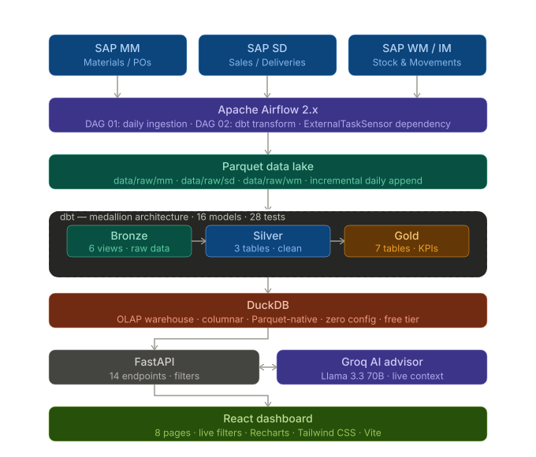

# SupplyIQ — Supply Chain Analytics Platform

An end-to-end, production-grade supply chain analytics pipeline demonstrating
data engineering, AI integration, and full-stack development across a single
cohesive project.

---

## Live demo

| | URL |
|--|--|
| **Dashboard** | [Deployed on Vercel](#) |
| **API docs** | [Deployed on Render](#) |

---

## Architecture



---

## What it does

SupplyIQ simulates a real SAP-connected supply chain operation across three
modules (MM, SD, WM/IM) and provides a complete analytics platform on top:

- **Incremental data generation** — `daily_trigger.py` generates one business
  day of SAP events at a time: new purchase orders, goods receipts against
  open POs, sales orders, outbound deliveries, and an end-of-day stock
  snapshot. Run `backfill.py` to generate a full date range in one command.

- **Airflow orchestration** — two production DAGs run on a schedule. DAG 01
  calls `daily_trigger.py` for the execution date and validates output files.
  DAG 02 waits for DAG 01 via `ExternalTaskSensor` then runs dbt bronze →
  silver → gold in sequence, finishing with all 28 data quality tests.

- **Medallion data warehouse** — raw Parquet files transformed through three
  dbt layers into DuckDB. Bronze renames SAP field codes to readable names.
  Silver joins tables, validates data, and adds business logic. Gold produces
  seven aggregated metric tables consumed directly by the API and AI advisor.

- **FastAPI backend** — 14 REST endpoints with filter parameters that push
  predicates into DuckDB queries rather than filtering in the browser.

- **Groq AI advisor** — a `POST /ai/ask` endpoint pulls live context from six
  gold tables, sends it to Llama 3.3 70B via Groq, and returns answers
  grounded in your actual pipeline data.

- **React dashboard** — eight pages with live charts, KPI cards, and
  filter dropdowns that re-fetch from the API on every change.

---

## Tech stack

| Layer | Technology |
|-------|-----------|
| Data generation | Python, NumPy, Faker |
| Orchestration | Apache Airflow 2.x |
| File storage | Parquet (PyArrow) |
| Transformation | dbt-duckdb |
| Data warehouse | DuckDB |
| Backend API | FastAPI, Uvicorn |
| AI advisor | Groq API, Llama 3.3 70B |
| Frontend | React, Vite, Tailwind CSS v3, Recharts |
| Deployment | Vercel (frontend), Render (backend) |

---

## dbt models — 16 total, 28 tests

### Bronze (6 views)
One view per SAP table. Renames field codes to readable names
(`EBELN` → `po_number`, `MATNR` → `material_id`) and casts date columns.
No logic — just structure.

### Silver (3 tables)
| Model | What it does |
|-------|-------------|
| `silver_purchase_orders` | Joins EKKO + EKPO, calculates fulfillment rate and delivery status per line |
| `silver_stock_movements` | Joins MKPF + MSEG, adds human-readable movement descriptions |
| `silver_sales_orders` | Joins VBAK + VBAP, adds order status text and fulfillment percentage |

### Gold (7 tables)
| Model | Business question it answers |
|-------|------------------------------|
| `gold_inventory_kpis` | What is the current stock level and days of supply per material/plant? |
| `gold_reorder_alerts` | Which materials need ordering now? What quantity, using EOQ and safety stock? |
| `gold_supplier_performance` | How reliable is each vendor? Fulfillment rate, overdue %, composite score |
| `gold_demand_signals` | What is the daily demand rate, variability, and velocity per material? |
| `gold_inventory_turnover` | How fast is stock moving? Which materials are slow-moving or at obsolescence risk? |
| `gold_financial_summary` | What is the gross margin, carrying cost, and working capital per material? |
| `gold_supply_risk` | What is the single-source risk, perfect order rate, and concentration score? |

---

## API endpoints

```
GET  /health
GET  /overview/kpis
GET  /overview/reorder-alerts     ?limit
GET  /overview/demand-trend       ?days
GET  /inventory/kpis              ?plant  &status
GET  /inventory/turnover
GET  /procurement/summary         ?vendor &status
GET  /procurement/overdue         ?vendor &limit
GET  /demand/signals              ?material &days
GET  /demand/orders               ?status  &material &days
GET  /suppliers/scorecards        ?rating  &sort_by
GET  /financial/summary           ?margin  &plant
GET  /risk/summary                ?category
POST /ai/ask                      { "question": "..." }
```

All filter parameters push predicates into DuckDB queries — no in-memory
filtering on the server side.

---

## Dashboard pages

| Page | Key metrics |
|------|------------|
| Overview | KPI cards, demand trend chart, stock status, reorder alerts |
| Inventory | Stock position by material/plant, days of supply, consumption rate |
| Procurement | PO status breakdown, overdue lines, vendor filter |
| Demand & sales | Demand signals, bar chart by material, fulfillment by period |
| Suppliers | Vendor scorecards, score progress bars, sortable by score/fulfillment/overdue |
| Financial | Gross margin by material, carrying costs, working capital |
| Supply risk | Risk scores, single-source flags, perfect order rate |
| AI advisor | Natural language questions answered from live gold layer data |

---

## Getting started

**Prerequisites:** Python 3.10+, Node 20+

```bash
# 1. Clone and set up Python environment
git clone https://github.com/vi6120/Supply-Chain-Analytics-Platform.git
cd Supply-Chain-Analytics-Platform
python3 -m venv venv
source venv/bin/activate        # Windows: venv\Scripts\activate
pip install -r requirements.txt

# 2. Generate 90 days of supply chain data
python scripts/backfill.py

# 3. Initialise DuckDB and register bronze views
python scripts/init_db.py

# 4. Run dbt transformations and tests
cd transform
dbt run
dbt test
cd ..

# 5. Set environment variable (free key at console.groq.com)
export GROQ_API_KEY=your_key_here

# 6. Start the API (Terminal 1)
uvicorn api.main:app --reload --port 8000

# 7. Start the dashboard (Terminal 2)
cd frontend
nvm use 20
npm install
npm run dev
```

Open `http://localhost:5173`

The interactive API docs are at `http://localhost:8000/docs`.

---

## Running a single day

```bash
python scripts/daily_trigger.py --date 2026-05-16
```

After each run, restart the API or wait for the `--reload` to pick up
the new Parquet data, then run `dbt run` to refresh the gold tables.

---

## Environment variables

| Variable | Required | Where to get it |
|----------|----------|----------------|
| `GROQ_API_KEY` | Yes | [console.groq.com](https://console.groq.com/keys) — free tier |

See `.env.example` for the full template.

---

## Project structure

```
Supply-Chain-Analytics-Platform/
├── scripts/
│   ├── daily_trigger.py      # one business day of SAP events
│   ├── backfill.py           # run daily_trigger over a date range
│   └── init_db.py            # register bronze views in DuckDB
├── airflow/
│   └── dags/
│       ├── 01_daily_ingestion.py   # 6am Mon–Fri, generates + validates data
│       └── 02_dbt_transform.py     # 6:30am, waits for DAG 01 then runs dbt
├── transform/
│   ├── models/
│   │   ├── bronze/           # 6 views — SAP field renaming + type casts
│   │   ├── silver/           # 3 tables — joins, enrichment, business logic
│   │   └── gold/             # 7 tables — KPIs, alerts, financial metrics
│   ├── tests/                # custom business logic SQL tests
│   ├── models/schema.yml     # 28 schema tests (not_null, unique, accepted_values)
│   └── dbt_project.yml       # medallion layer config
├── api/
│   ├── main.py               # FastAPI app, CORS, router registration
│   ├── database.py           # DuckDB connection + NaN cleaner
│   └── routers/
│       ├── overview.py
│       ├── inventory.py
│       ├── procurement.py
│       ├── demand.py
│       ├── supplier.py
│       ├── financial.py
│       ├── risk.py
│       └── ai.py             # Groq AI advisor endpoint
├── frontend/
│   └── src/
│       ├── pages/            # 8 React pages
│       ├── components/ui.jsx # shared KpiCard, Badge, Card, FilterBar components
│       └── api/client.js     # Axios client with all 14 endpoint functions
├── docs/
│   ├── architecture.svg      # pipeline architecture diagram
│   └── screenshot.png        # dashboard screenshot
├── .env.example
└── requirements.txt
```

---

## Key design decisions

**Why incremental Parquet instead of a live database write?**
Mirrors how real SAP integrations work — OData APIs are polled on a schedule
and results written to a staging area. The pipeline is decoupled: ingestion
and transformation are independent steps, each testable in isolation.

**Why dbt with DuckDB?**
dbt brings version-controlled, testable transformations with automatic
dependency resolution. DuckDB reads Parquet natively without an import step,
so the bronze layer is zero-cost views. For a student project it's completely
free; for production, MotherDuck provides a managed cloud tier.

**Why backend filtering?**
Filter parameters push predicates into DuckDB SQL rather than loading all
rows and filtering in the browser. This is the correct production pattern —
the database does the work it's optimised for, the API just shuttles results.

**Why Groq over other LLM providers?**
Sub-second inference on Llama 3.3 70B, free tier, no card required. The AI
advisor pulls a fresh context snapshot from six gold tables per request so
every answer references actual numbers from the pipeline.

---

## Airflow DAG schedule

| DAG | Schedule | What it does |
|-----|----------|-------------|
| `01_daily_sap_ingestion` | 6:00am Mon–Fri | Generates daily events, validates Parquet output |
| `02_dbt_transform` | 6:30am Mon–Fri | Waits for DAG 01, runs bronze → silver → gold, tests |

DAG 02 uses `ExternalTaskSensor` on DAG 01's `validate_output` task — the
gold layer never refreshes against incomplete data.
