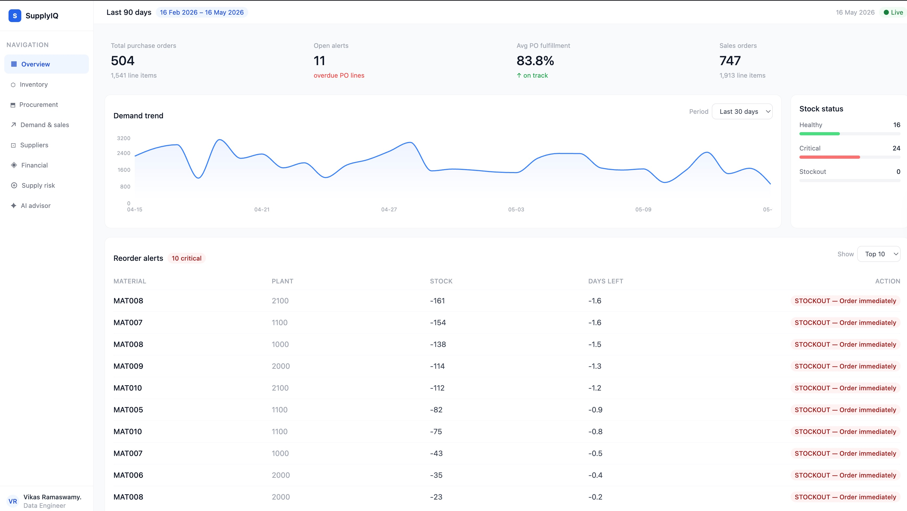

# SupplyIQ — Supply Chain Analytics Platform

An end-to-end, industry-grade supply chain analytics pipeline built to demonstrate
production data engineering, AI integration, and full-stack development skills.



## Live Demo

- **Dashboard** — [Deployed on Vercel](#) *(coming soon)*
- **API docs** — [Deployed on Render](#) *(coming soon)*

---

## What it does

SupplyIQ simulates a real SAP-connected supply chain operation and provides:

- **Daily data ingestion** — synthetic SAP MM, SD, and WM/IM events generated
  incrementally, one business day at a time, with realistic lead times, partial
  deliveries, and goods movements
- **Medallion data warehouse** — raw Parquet files transformed through Bronze →
  Silver → Gold layers via dbt, stored in DuckDB
- **13 REST API endpoints** — FastAPI backend serving filtered analytics from
  the gold layer
- **8-page React dashboard** — live charts, KPI cards, and backend-filtered
  tables for inventory, procurement, demand, suppliers, financials, and risk
- **AI supply chain advisor** — Groq + Llama 3.3 70B answers questions grounded
  in your actual pipeline data pulled from the gold layer in real time

---

## Tech stack

| Layer | Technology |
|-------|-----------|
| Data generation | Python, Faker, NumPy |
| Data warehouse | DuckDB / MotherDuck |
| Transformation | dbt-duckdb (medallion architecture) |
| Orchestration | Apache Airflow 2.x *(DAGs included)* |
| Backend API | FastAPI, Uvicorn |
| AI advisor | Groq API, Llama 3.3 70B |
| Frontend | React, Vite, Tailwind CSS, Recharts |
| Deployment | Vercel (frontend), Render (backend) |

---

## Architecture


---

## dbt models (16 total, 28 tests)

**Bronze** — 6 views, one per SAP table. Renames SAP field codes to readable
names (`EBELN` → `po_number`) and casts date types.

**Silver** — 3 tables. Joins PO headers + items, enriches with business logic,
calculates fulfillment rates and delivery status.

**Gold** — 7 tables covering:
- `gold_inventory_kpis` — stock levels, days of supply, consumption rates
- `gold_reorder_alerts` — EOQ, safety stock, reorder point per material/plant
- `gold_supplier_performance` — vendor scorecards with composite scoring
- `gold_demand_signals` — daily demand aggregation, variability, velocity
- `gold_inventory_turnover` — annualised turnover, slow-mover detection
- `gold_financial_summary` — gross margin, carrying costs, working capital
- `gold_supply_risk` — single-source risk, perfect order rate, concentration

---

## API endpoints

```
GET  /health
GET  /overview/kpis
GET  /overview/reorder-alerts     ?limit
GET  /overview/demand-trend       ?days
GET  /inventory/kpis              ?plant  &status
GET  /inventory/turnover
GET  /procurement/summary         ?vendor &status
GET  /procurement/overdue         ?vendor &limit
GET  /demand/signals              ?material &days
GET  /demand/orders               ?status  &material &days
GET  /suppliers/scorecards        ?rating  &sort_by
GET  /financial/summary           ?margin  &plant
GET  /risk/summary                ?category
POST /ai/ask                      { question }
```

---

## Running locally

**Prerequisites:** Python 3.10+, Node 20+

```bash
# Clone and set up Python environment
git clone https://github.com/vi6120/Supply-Chain-Analytics-Platform.git
cd Supply-Chain-Analytics-Platform
python3 -m venv venv
source venv/bin/activate
pip install -r requirements.txt

# Generate 90 days of supply chain data
python scripts/backfill.py

# Initialise DuckDB and register bronze views
python scripts/init_db.py

# Run dbt transformations and tests
cd transform
dbt run
dbt test
cd ..

# Set environment variable
export GROQ_API_KEY=your_groq_key_here   # free at console.groq.com

# Start the API
uvicorn api.main:app --reload --port 8000
```

In a second terminal:

```bash
cd frontend
nvm use 20
npm install
npm run dev
```

Open `http://localhost:5173`

---

## Project structure

```
Supply-Chain-Analytics-Platform/
├── scripts/
│   ├── daily_trigger.py      # generates one business day of SAP events
│   ├── backfill.py           # runs daily_trigger for a date range
│   └── init_db.py            # registers bronze views in DuckDB
├── transform/
│   ├── models/
│   │   ├── bronze/           # 6 views — SAP field renaming + type casts
│   │   ├── silver/           # 3 tables — joins, enrichment, business logic
│   │   └── gold/             # 7 tables — KPIs, alerts, financial metrics
│   ├── tests/                # custom business logic tests
│   └── models/schema.yml     # 28 automated data quality tests
├── api/
│   ├── main.py               # FastAPI app + CORS
│   ├── database.py           # DuckDB connection + NaN cleaner
│   └── routers/              # one router per dashboard page
├── frontend/
│   └── src/
│       ├── pages/            # 8 React pages
│       ├── components/       # shared UI components
│       └── api/              # Axios client
├── .env.example              # required environment variables
└── requirements.txt
```

---

## Key design decisions

**Why DuckDB?** Embedded, zero-config, columnar OLAP engine that reads Parquet
natively. No database server to manage. Free MotherDuck cloud tier for sharing.

**Why dbt?** Transforms are version-controlled SQL with automatic dependency
resolution, built-in testing, and full lineage. Every model is reproducible
and testable in isolation.

**Why backend filtering?** Filter parameters hit DuckDB via FastAPI rather than
filtering in the browser — demonstrates full-stack data flow and correct
production architecture.

**Why Groq?** Free tier, sub-second inference on Llama 3.3 70B. The AI advisor
pulls live context from 6 gold tables per request so answers are grounded in
real pipeline data, not hallucinated.

---

## Environment variables

See `.env.example` for the full list. Required to run:

```
GROQ_API_KEY=     # from console.groq.com — free
```